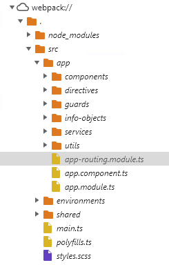
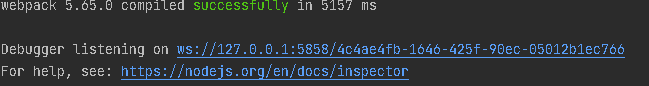
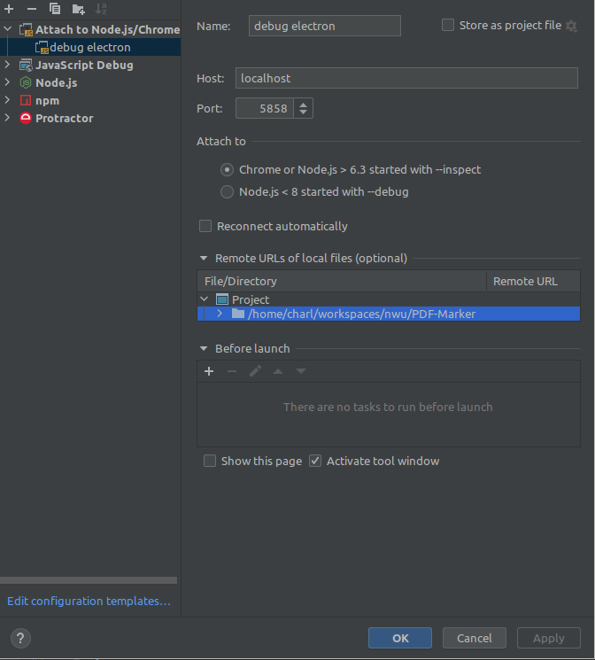

# Debugging application

## Frontend Debugging
To debug the front-end you can use the build in web-inspector in electron by using the **View** > **Toggle Developer Tools** menu

Debugging the front-end will only really be useful if you are running a development build (eg. npm run start) which includes source maps (else you will be looking at minified code)

Start the application in development mode
```
npm run start
```

Angular sources are availble in the source tree at webpack:///./src/




## Backend Debugging

To debug the backend you need to be running electron with the “--inspect=5858” parameter. This is already included when you use “npm run start”

Start the application in development mode
```
npm run start
```
You now have multiple options for debugging the application. You can use IntelliJ directly, or you can use any chrome based browser

### Debugging with intellij

If you started the application from within intellij you will see about simmilar to this in the console



You can just click on that first link, and it will automatically start debugging

Else, you can setup a debugging run configuration as shown below which will also attach the debugger to a running instance



_Make sure to add the source directory_

### Debug log level
In the browser console, run the following `window.debug()`. The browser and backend will now print debug logging.
