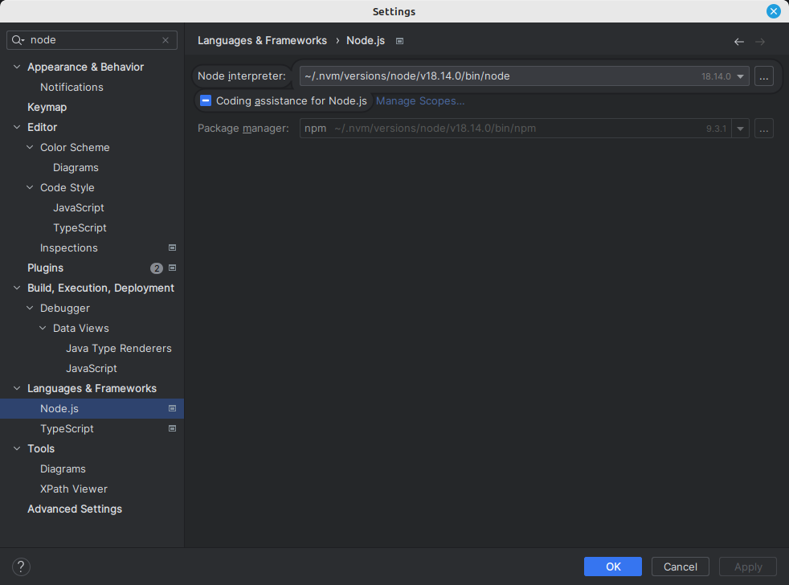
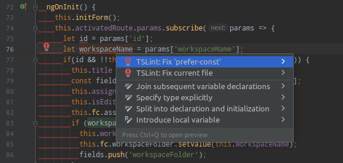
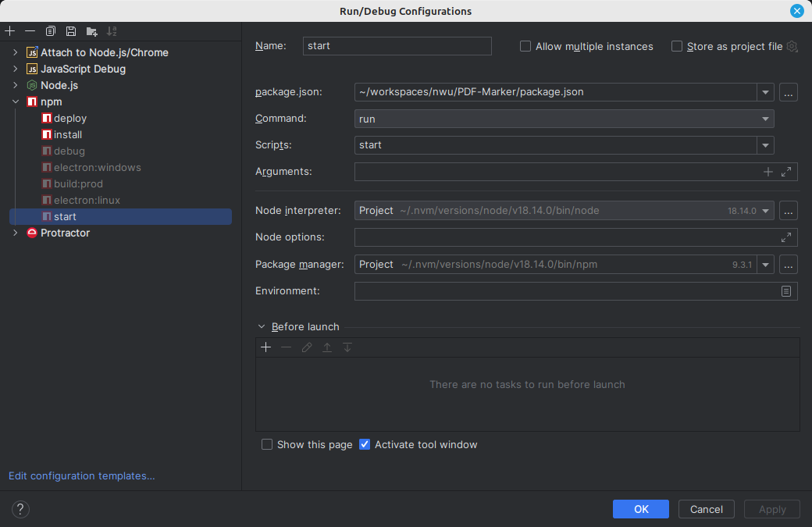

# IDE configurations

## Configure IntelliJ

### Configure NodeJS and NPM
Open project settings screen, and navigate to **Languages & Frameworks** > **Node.js**
Point the **Node Interpreter** to where the correct version of **NodeJS** is installed on your computer
Make sure the **Package Manager** is **npm** and points to the appropriate installation

### TSLint
TSlint provides feedback on coding stardards configured by various tslint.json files. The project makes use of the default configuration provided by Angular.

Initially it can be quite daunting to fix all the suggestions, but once done it is easy to keep it up to date

To enable IDE feedback for TSLint, a TSlint compatible IDE is required. Here we’ll show how to configure with IntelliJ

1. Firstly make sure NodeJS and NPM is properly configured for your project
2. Open project settings screen, and navigate to Languages & Frameworks > TSLint
3. Select Automatic TSLint configuration
4. Your IDE will now validate javascript and typescript files and provide feedback and recommendations

### Configure build profiles
You can configure any of the build configuration that are available in `package.json` as a selectable build
profile in IntelliJ
e.g for `npm run start`

