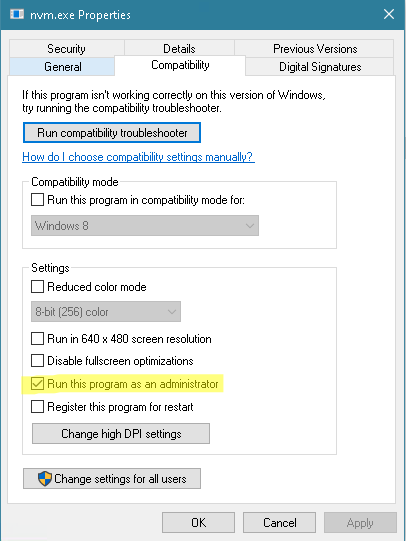

# NVM for NodeJS versions
nvm is a tool that can be used to run different node versions. The tool is different for Linux and Windows, but in principle they work the same


## Installing NVM
### Windows installation
- Make sure to remove all other versions of NodeJS that is on the system path
- Install the latest release of [https://github.com/coreybutler/nvm-windows/releases]()
- After install mark the nvm.exe with Administator priviledges (this avoids having to open terminals as admin all the time)
  C:\Users\USERNAME\AppData\Roaming\nvm\



### Linux installation
- Make sure to remove all other versions of NodeJs that is on the system path
- Install the latest release of [https://github.com/nvm-sh/nvm/releases]()

## Using NVM
Make sure to first install nvm by following either the windows or linux steps

### Install version on nodeJS
Open a terminal in the directory you will be running commands from (this may be done inside intellij’s terminal too)

Install the version you need, eg. 18

```bash
nvm install 18
```
You can specify the full version if you want. e.g `18.14.0`

### Check the node version
Always make sure your node version is what is required for the project/project version you are working on

Open a terminal in the directory you will be running commands from (this may be done inside intellij’s terminal too)

Check the version

```bash
node --version
```
If this is not the version you want, see below how to change it

### Change node version
Open a terminal in the directory you will be running commands from (this may be done inside intellij’s terminal too)

Change the version

```bash
nvm use 18.14.0
```

